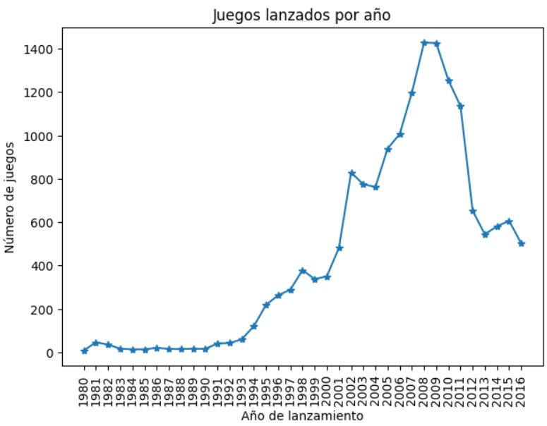
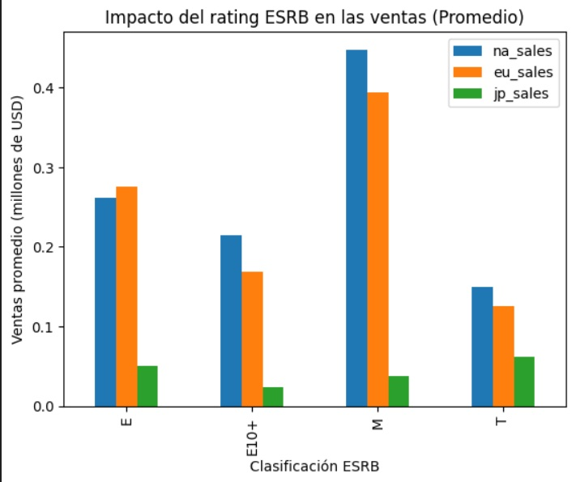
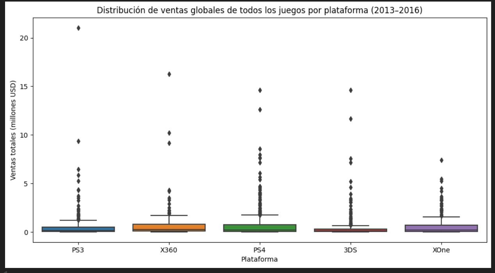
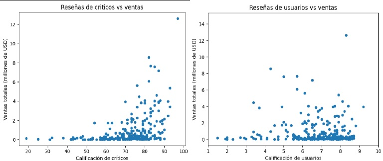
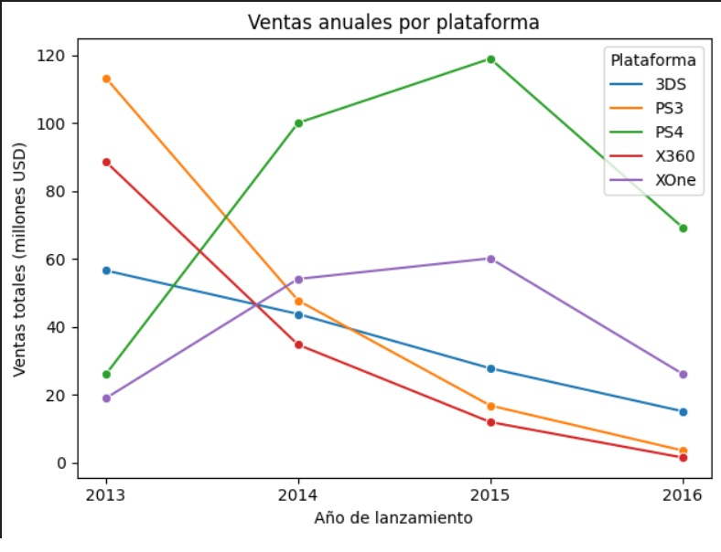

🎮📊 Ice – Análisis de Ventas de Videojuegos

📌 Contexto
Análisis de ventas globales de videojuegos por plataforma, género y región para una tienda online internacional ficticia “Ice”.
El conjunto de datos incluye: ventas por región, reseñas de usuarios y críticos, géneros, plataformas y clasificación ESRB (edad recomendada).
📁 Dataset: games.csv

🎯 Objetivos
Identificar videojuegos más rentablesen funcion de plataformas, géneros y regiones.
Validar diferencias en preferencias de usuarios mediante pruebas de hipótesis.
Generar perfiles regionales y recomendaciones estratégicas para optimizar campañas de marketing y priorizar lanzamientos.

💻 Procesamiento de datos
Limpieza y validación de datos: duplicados, valores ausentes.
Cálculo de ventas totales y agregación por plataforma, género y región.
Análisis exploratorio (EDA) de tendencias y patrones de ventas.
Evaluación de relación entre reseñas y ventas.
Segmentación de perfiles de usuario por región.
Pruebas de hipótesis para validar diferencias en calificaciones entre plataformas y géneros.

🔎 Principales Hallazgos

💰 Ventas por Plataforma y Género
PlayStation y Xbox dominan en NA y EU, mientras que Japón prefiere consolas portátiles.
Géneros Action y Shooter lideran ventas en NA/EU; Role-Playing en Japón.
Las ventas dependen de la región, género y plataforma, lo que ayuda a priorizar lanzamientos.

📝 Calificaciones y Reseñas
No hay diferencia significativa en calificaciones de usuarios entre Xbox One y PC.
Diferencia significativa entre géneros Action y Sports, confirmando que el tipo de juego afecta la valoración de usuarios.

🌎 Clasificación ESRB
NA y EU: juegos Mature (M) generan mayores ingresos pero con alta dispersión.
Japón: ventas más homogéneas entre clasificaciones, menor impacto del rating.

📌 Recomendaciones Estratégicas
Segmentar campañas de marketing por región y género para maximizar ventas.
Priorizar lanzamientos de géneros y plataformas con mayor demanda regional.
Usar datos de calificaciones y ESRB para evaluar riesgos y oportunidades.

📈 Algunas Visualizaciones

 

  
